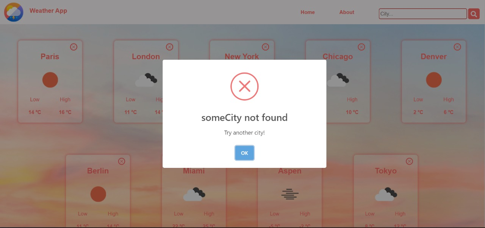
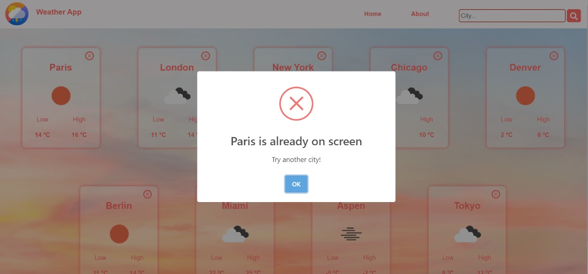
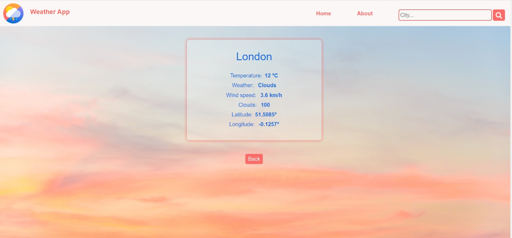
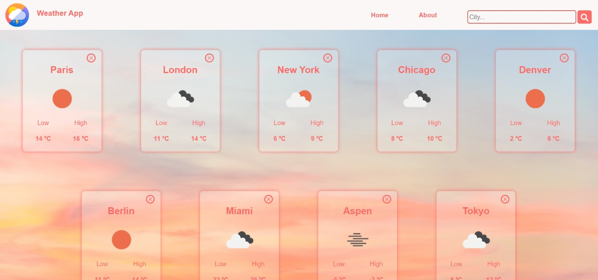

# Weather App

  
  
  
  

This weather app was developed during Henry's Bootcamp to practice React and CSS. It consumes data from the external API [OpenWeather](https://openweathermap.org/current) and allows you to search cities by name and get to know their weather in real-time. The app has a responsive design so you can access it from any device.

Link to [Deploy](https://weather-app-ten-ebon.vercel.app/) made in vercel